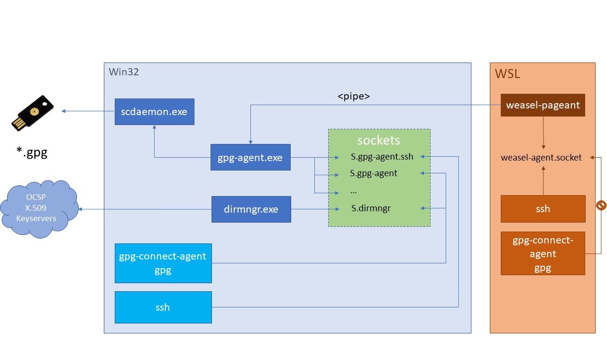

This is a guide to using [YubiKey](https://www.yubico.com/products/yubikey-hardware/) as a [SmartCard](https://security.stackexchange.com/questions/38924/how-does-storing-gpg-ssh-private-keys-on-smart-cards-compare-to-plain-usb-drives) for storing GPG encryption, signing and authentication keys, which can also be used for SSH. Many of the principles in this document are applicable to other smart card devices.

Keys stored on YubiKey are [non-exportable](https://support.yubico.com/support/solutions/articles/15000010242-can-i-duplicate-or-back-up-a-yubikey-) (as opposed to file-based keys that are stored on disk) and are convenient for everyday use. Instead of having to remember and enter passphrases to unlock SSH/GPG keys, YubiKey needs only a physical touch after being unlocked with a PIN. All signing and encryption operations happen on the card, rather than in OS memory.

**New!** [drduh/Purse](https://github.com/drduh/Purse) is a password manager which uses GPG and YubiKey.

If you have a comment or suggestion, please open an [Issue](https://github.com/drduh/YubiKey-Guide/issues) on GitHub.

- [Purchase](#purchase)
- [Prepare environment](#prepare-environment)
- [Required software](#required-software)
  * [Debian and Ubuntu](#debian-and-ubuntu)
  * [Arch](#arch)
  * [RHEL7](#rhel7)
  * [NixOS](#nixos)
  * [OpenBSD](#openbsd)
  * [macOS](#macos)
  * [Windows](#windows)
- [Entropy](#entropy)
- [Creating keys](#creating-keys)
  * [Temporary working directory](#temporary-working-directory)
  * [Harden configuration](#harden-configuration)
- [Master key](#master-key)
- [Sign with existing key](#sign-with-existing-key)
- [Sub-keys](#sub-keys)
  * [Signing](#signing)
  * [Encryption](#encryption)
  * [Authentication](#authentication)
  * [Add extra identities](#add-extra-identities)
- [Verify](#verify)
- [Export secret keys](#export-secret-keys)
- [Revocation certificate](#revocation-certificate)
- [Backup](#backup)
- [Export public keys](#export-public-keys)
- [Configure Smartcard](#configure-smartcard)
  * [Change PIN](#change-pin)
  * [Set information](#set-information)
- [Transfer keys](#transfer-keys)
  * [Signing](#signing-1)
  * [Encryption](#encryption-1)
  * [Authentication](#authentication-1)
- [Verify card](#verify-card)
- [Multiple YubiKeys](#multiple-yubikeys)
- [Cleanup](#cleanup)
- [Using keys](#using-keys)
- [Rotating keys](#rotating-keys)
  * [Setup environment](#setup-environment)
  * [Renewing sub-keys](#renewing-sub-keys)
  * [Rotating keys](#rotating-keys-1)
- [SSH](#ssh)
  * [Create configuration](#create-configuration)
  * [Replace agents](#replace-agents)
  * [Copy public key](#copy-public-key)
  * [(Optional) Save public key for identity file configuration](#-optional--save-public-key-for-identity-file-configuration)
  * [Connect with public key authentication](#connect-with-public-key-authentication)
  * [Import SSH keys](#import-ssh-keys)
  * [Remote Machines (Agent Forwarding)](#remote-machines--agent-forwarding-)
    + [Steps for older distributions](#steps-for-older-distributions)
  * [GitHub](#github)
  * [OpenBSD](#openbsd-1)
  * [Windows](#windows-1)
    + [WSL](#wsl)
      - [Prerequisites](#prerequisites)
      - [WSL configuration](#wsl-configuration)
      - [Remote host configuration](#remote-host-configuration)
- [Using Multiple Keys](#using-multiple-keys)
- [Require touch](#require-touch)
- [Email](#email)
  * [Mailvelope on macOS](#mailvelope-on-macos)
- [Reset](#reset)
- [Notes](#notes)
- [Troubleshooting](#troubleshooting)
- [Links](#links)


# Purchase

All YubiKeys except the blue "security key" model are compatible with this guide. NEO models are limited to 2048-bit RSA keys. Compare YubiKeys [here](https://www.yubico.com/products/yubikey-hardware/compare-products-series/).

To verify a YubiKey is genuine, open a [browser with U2F support](https://support.yubico.com/support/solutions/articles/15000009591-how-to-confirm-your-yubico-device-is-genuine-with-u2f) to [https://www.yubico.com/genuine/](https://www.yubico.com/genuine/). Insert a Yubico device, and select *Verify Device* to begin the process. Touch the YubiKey when prompted, and if asked, allow it to see the make and model of the device. If you see *Verification complete*, the device is authentic.

This website verifies YubiKey device attestation certificates signed by a set of Yubico certificate authorities, and helps mitigate [supply chain attacks](https://media.defcon.org/DEF%20CON%2025/DEF%20CON%2025%20presentations/DEF%20CON%2025%20-%20r00killah-and-securelyfitz-Secure-Tokin-and-Doobiekeys.pdf).

You will also need several small storage devices (microSD cards work well) for storing encrypted backups of your keys.

# Prepare environment

To create cryptographic keys, a secure environment that can be reasonably assured to be free of adversarial control is recommended. Here is a general ranking of environments most to least likely to be compromised:

1. Daily-use operating system
1. Virtual machine on daily-use host OS (using [virt-manager](https://virt-manager.org/), VirtualBox, or VMWare)
1. Separate hardened [Debian](https://www.debian.org/) or [OpenBSD](https://www.openbsd.org/) installation which can be dual booted
1. Live image, such as [Debian Live](https://www.debian.org/CD/live/) or [Tails](https://tails.boum.org/index.en.html)
1. Secure hardware/firmware ([Coreboot](https://www.coreboot.org/), [Intel ME removed](https://github.com/corna/me_cleaner))

1. Dedicated air-gapped system with no networking capabilities

This guide recommends using a bootable "live" Debian Linux image to provide such an environment, however, depending on your threat model, you may want to take fewer or more steps to secure it.

To use Debian Live, download the latest image:

```console
$ curl -LfO https://cdimage.debian.org/debian-cd/current-live/amd64/iso-hybrid/debian-live-10.4.0-amd64-xfce.iso

$ curl -LfO https://cdimage.debian.org/debian-cd/current-live/amd64/iso-hybrid/SHA512SUMS

$ curl -LfO https://cdimage.debian.org/debian-cd/current-live/amd64/iso-hybrid/SHA512SUMS.sign
```

Verify the signature of the hashes file with GPG:

```console
$ gpg --verify SHA512SUMS.sign SHA512SUMS
gpg: Signature made Sat 09 May 2020 05:17:57 PM PDT
gpg:                using RSA key DF9B9C49EAA9298432589D76DA87E80D6294BE9B
gpg: Can't check signature: No public key

$ gpg --keyserver hkps://keyring.debian.org --recv DF9B9C49EAA9298432589D76DA87E80D6294BE9B
gpg: key 0xDA87E80D6294BE9B: public key "Debian CD signing key <debian-cd@lists.debian.org>" imported
gpg: Total number processed: 1
gpg:               imported: 1

$ gpg --verify SHA512SUMS.sign SHA512SUMS
gpg: Signature made Sat 09 May 2020 05:17:57 PM PDT
gpg:                using RSA key DF9B9C49EAA9298432589D76DA87E80D6294BE9B
gpg: Good signature from "Debian CD signing key <debian-cd@lists.debian.org>" [unknown]
gpg: WARNING: This key is not certified with a trusted signature!
gpg:          There is no indication that the signature belongs to the owner.
Primary key fingerprint: DF9B 9C49 EAA9 2984 3258  9D76 DA87 E80D 6294 BE9B
```

If the public key cannot be received, try changing the DNS resolver and/or use a different keyserver:

```console
$ gpg --keyserver hkps://keyserver.ubuntu.com:443 --recv DF9B9C49EAA9298432589D76DA87E80D6294BE9B
```

Ensure the SHA512 hash of the live image matches the one in the signed file.

```console
$ grep $(sha512sum debian-live-10.4.0-amd64-xfce.iso) SHA512SUMS
SHA512SUMS:2920f398c5e9036fcec8f71b2f28b0f2a85e3ab805e66088192dc56f679e5f59f26634e8bbde70badc3cf7ce353f54a2757b2017cbc3d3df9fb2b2065b3c1041  debian-live-10.4.0-amd64-xfce.iso
```

See [Verifying authenticity of Debian CDs](https://www.debian.org/CD/verify) for more information.

Mount a storage device and copy the image to it:

**Linux**

```console
$ sudo dmesg | tail
usb-storage 3-2:1.0: USB Mass Storage device detected
scsi host2: usb-storage 3-2:1.0
scsi 2:0:0:0: Direct-Access     TS-RDF5  SD  Transcend    TS3A PQ: 0 ANSI: 6
sd 2:0:0:0: Attached scsi generic sg1 type 0
sd 2:0:0:0: [sdb] 31116288 512-byte logical blocks: (15.9 GB/14.8 GiB)
sd 2:0:0:0: [sdb] Write Protect is off
sd 2:0:0:0: [sdb] Mode Sense: 23 00 00 00
sd 2:0:0:0: [sdb] Write cache: disabled, read cache: enabled, doesn't support DPO or FUA
sdb: sdb1 sdb2
sd 2:0:0:0: [sdb] Attached SCSI removable disk

$ sudo dd if=debian-live-10.4.0-amd64-xfce.iso of=/dev/sdb bs=4M; sync
465+1 records in
465+1 records out
1951432704 bytes (2.0 GB, 1.8 GiB) copied, 42.8543 s, 45.5 MB/s
```

**OpenBSD**

```console
$ dmesg | tail -n2
sd2 at scsibus4 targ 1 lun 0: <TS-RDF5, SD Transcend, TS3A> SCSI4 0/direct removable serial.0000000000000
sd2: 15193MB, 512 bytes/sector, 31116288 sectors

$ doas dd if=debian-live-10.4.0-amd64-xfce.iso of=/dev/rsd2c bs=4m
465+1 records in
465+1 records out
1951432704 bytes transferred in 139.125 secs (14026448 bytes/sec)
```

Shut down the computer and disconnect internal hard drives and all unnecessary peripheral devices. If being run within a VM, this part can be skipped as no such devices should be attached to the VM since the image will still be run as a "live image".

# Required software

Boot the live image and configure networking.

**Note** If the screen locks, unlock with `user`/`live`.

Open the terminal and install required software packages.

## Debian and Ubuntu

**Note** Live Ubuntu images [may require modification](https://github.com/drduh/YubiKey-Guide/issues/116) to `/etc/apt/sources.list`

```console
$ sudo apt update

$ sudo apt -y upgrade

$ sudo apt -y install wget gnupg2 gnupg-agent dirmngr cryptsetup scdaemon pcscd secure-delete hopenpgp-tools yubikey-personalization
```

To download a copy of this guide:

```console
$ wget https://raw.githubusercontent.com/drduh/YubiKey-Guide/master/README.md
```

To install and use the `ykman` utility:

```console
$ sudo apt -y install python-pip python-pyscard

$ pip install yubikey-manager

$ sudo service pcscd start

$ ~/.local/bin/ykman openpgp info
```

## Arch

```console
$ sudo pacman -Syu gnupg pcsclite ccid hopenpgp-tools yubikey-personalization
```

## RHEL7

```console
$ sudo yum install -y gnupg2 pinentry-curses pcsc-lite pcsc-lite-libs gnupg2-smime
```

## NixOS

Generate a NixOS LiveCD image with the given config:

```nix
# yubikey-installer.nix
{ nixpkgs ? <nixpkgs>, system ? "x86_64-linux" } :

let
  config = { pkgs, ... }:
  with pkgs; {
    imports = [ <nixpkgs/nixos/modules/installer/cd-dvd/installation-cd-graphical-kde.nix> ];

    boot.kernelPackages = linuxPackages_latest;

    services.pcscd.enable = true;
    services.udev.packages = [ yubikey-personalization ];

    environment.systemPackages = [ gnupg pinentry-curses pinentry-qt paperkey wget ];

    programs = {
      ssh.startAgent = false;
      gnupg.agent = {
        enable = true;
        enableSSHSupport = true;
      };
    };
  };

  evalNixos = configuration: import <nixpkgs/nixos> {
    inherit system configuration;
  };

in {
  iso = (evalNixos config).config.system.build.isoImage;
}
```

Build the installer and copy it to a USB drive.

```console
$ nix build -f yubikey-installer.nix --out-link installer

$ sudo cp -v installer/iso/*.iso /dev/sdb; sync
'installer/iso/nixos-20.03.git.c438ce1-x86_64-linux.iso' -> '/dev/sdb'
```

On NixOS, ensure that you have `pinentry-program /run/current-system/sw/bin/pinentry-curses` in your `$GNUPGHOME/gpg-agent.conf` before running any `gpg` commands.


## OpenBSD

```console
$ doas pkg_add gnupg pcsc-tools
```

## macOS

Download and install [Homebrew](https://brew.sh/) and the following packages:

```console
$ brew install gnupg yubikey-personalization hopenpgp-tools ykman pinentry-mac
```

**Note** An additional Python package dependency may need to be installed to use [`ykman`](https://support.yubico.com/support/solutions/articles/15000012643-yubikey-manager-cli-ykman-user-guide) - `pip install yubikey-manager`

## Windows

Download and install [Gpg4Win](https://www.gpg4win.org/) and [PuTTY](https://putty.org).

You may also need more recent versions of [yubikey-personalization](https://developers.yubico.com/yubikey-personalization/Releases/) and [yubico-c](https://developers.yubico.com/yubico-c/Releases/).

# Entropy

Generating cryptographic keys requires high-quality [randomness](https://www.random.org/randomness/), measured as entropy.

To check the available entropy available on Linux:

```console
$ cat /proc/sys/kernel/random/entropy_avail
849
```

Most operating systems use software-based pseudorandom number generators. A hardware random number generator like [OneRNG](https://onerng.info/onerng/) will [increase the speed](https://lwn.net/Articles/648550/) of entropy generation and possibly the quality.

Install and configure OneRNG software:

```console
$ sudo apt -y install at rng-tools python-gnupg openssl

$ wget https://github.com/OneRNG/onerng.github.io/raw/master/sw/onerng_3.6-1_all.deb

$ sha256sum onerng_3.6-1_all.deb
a9ccf7b04ee317dbfc91518542301e2d60ebe205d38e80563f29aac7cd845ccb  onerng_3.6-1_all.deb

$ sudo dpkg -i onerng_3.6-1_all.deb

$ echo "HRNGDEVICE=/dev/ttyACM0" | sudo tee /etc/default/rng-tools
```

Plug in the device and restart rng-tools:

```console
$ sudo atd

$ sudo service rng-tools restart
```

Test by emptying `/dev/random` - the light on the device will dim briefly:

```console
$ cat /dev/random >/dev/null
[Press Control-C]
```

After a few seconds, verify the available entropy pool is quickly re-seeded:

```console
$ cat /proc/sys/kernel/random/entropy_avail
3049
```

An entropy pool value greater than 2000 is sufficient.

# Creating keys

## Temporary working directory

Create a temporary directory which will be cleared on [reboot](https://en.wikipedia.org/wiki/Tmpfs) and set it as the GnuPG directory:

```console
$ export GNUPGHOME=$(mktemp -d)
```

Otherwise, to preserve the working environment, set the GnuPG directory to your home folder:

```console
$ export GNUPGHOME=~/gnupg-workspace
```

## Harden configuration

Create a hardened configuration in the temporary working directory with the following options:

```console
$ wget -O $GNUPGHOME/gpg.conf https://raw.githubusercontent.com/drduh/config/master/gpg.conf

$ grep -ve "^#" $GNUPGHOME/gpg.conf
personal-cipher-preferences AES256 AES192 AES
personal-digest-preferences SHA512 SHA384 SHA256
personal-compress-preferences ZLIB BZIP2 ZIP Uncompressed
default-preference-list SHA512 SHA384 SHA256 AES256 AES192 AES ZLIB BZIP2 ZIP Uncompressed
cert-digest-algo SHA512
s2k-digest-algo SHA512
s2k-cipher-algo AES256
charset utf-8
fixed-list-mode
no-comments
no-emit-version
keyid-format 0xlong
list-options show-uid-validity
verify-options show-uid-validity
with-fingerprint
require-cross-certification
no-symkey-cache
use-agent
throw-keyids
```

Disable networking for the remainder of the setup.

# Master key

The first key to generate is the master key. It will be used for certification only: to issue sub-keys that are used for encryption, signing and authentication.

**Important** The master key should be kept offline at all times and only accessed to revoke or issue new sub-keys. Keys can also be generated on the YubiKey itself to ensure no other copies exist.

You'll be prompted to enter and verify a passphrase - keep it handy as you'll need it multiple times later.

Generate a strong passphrase which could be written down in a secure place or memorized:

```console
$ gpg --gen-random --armor 0 24
ydOmByxmDe63u7gqx2XI9eDgpvJwibNH
```

Use upper case letters for improved readability if they are written down:

```console
$ tr -dc '[:upper:]' < /dev/urandom | fold -w 20 | head -n1
BSSYMUGGTJQVWZZWOPJG
```

On Linux or OpenBSD, select the password using the mouse or by double-clicking on it to copy to clipboard. Paste using the middle mouse button or `Shift`-`Insert`.

Generate a new key with GPG, selecting `(8) RSA (set your own capabilities)`, `Certify` capability only and `4096` bit key size.

Do not set the master key to expire - see [Note #3](#notes).

```console
$ gpg --expert --full-generate-key

Please select what kind of key you want:
   (1) RSA and RSA (default)
   (2) DSA and Elgamal
   (3) DSA (sign only)
   (4) RSA (sign only)
   (7) DSA (set your own capabilities)
   (8) RSA (set your own capabilities)
   (9) ECC and ECC
  (10) ECC (sign only)
  (11) ECC (set your own capabilities)
  (13) Existing key
Your selection? 8

Possible actions for a RSA key: Sign Certify Encrypt Authenticate
Current allowed actions: Sign Certify Encrypt

   (S) Toggle the sign capability
   (E) Toggle the encrypt capability
   (A) Toggle the authenticate capability
   (Q) Finished

Your selection? E

Possible actions for a RSA key: Sign Certify Encrypt Authenticate
Current allowed actions: Sign Certify

   (S) Toggle the sign capability
   (E) Toggle the encrypt capability
   (A) Toggle the authenticate capability
   (Q) Finished

Your selection? S

Possible actions for a RSA key: Sign Certify Encrypt Authenticate
Current allowed actions: Certify

   (S) Toggle the sign capability
   (E) Toggle the encrypt capability
   (A) Toggle the authenticate capability
   (Q) Finished

Your selection? Q
RSA keys may be between 1024 and 4096 bits long.
What keysize do you want? (2048) 4096
Requested keysize is 4096 bits
Please specify how long the key should be valid.
         0 = key does not expire
      <n>  = key expires in n days
      <n>w = key expires in n weeks
      <n>m = key expires in n months
      <n>y = key expires in n years
Key is valid for? (0) 0
Key does not expire at all
Is this correct? (y/N) y
```

Input any name and email address:

```console
GnuPG needs to construct a user ID to identify your key.

Real name: Dr Duh
Email address: doc@duh.to
Comment: [Optional - leave blank]
You selected this USER-ID:
    "Dr Duh <doc@duh.to>"

Change (N)ame, (C)omment, (E)mail or (O)kay/(Q)uit? o

We need to generate a lot of random bytes. It is a good idea to perform
some other action (type on the keyboard, move the mouse, utilize the
disks) during the prime generation; this gives the random number
generator a better chance to gain enough entropy.

gpg: /tmp.FLZC0xcM/trustdb.gpg: trustdb created
gpg: key 0xFF3E7D88647EBCDB marked as ultimately trusted
gpg: directory '/tmp.FLZC0xcM/openpgp-revocs.d' created
gpg: revocation certificate stored as '/tmp.FLZC0xcM/openpgp-revocs.d/011CE16BD45B27A55BA8776DFF3E7D88647EBCDB.rev'
public and secret key created and signed.

pub   rsa4096/0xFF3E7D88647EBCDB 2017-10-09 [C]
      Key fingerprint = 011C E16B D45B 27A5 5BA8  776D FF3E 7D88 647E BCDB
uid                              Dr Duh <doc@duh.to>
```

Export the key ID as a [variable](https://stackoverflow.com/questions/1158091/defining-a-variable-with-or-without-export/1158231#1158231) (`KEYID`) for use later:

```console
$ export KEYID=0xFF3E7D88647EBCDB
```

# Sign with existing key

(Optional) If you already have a PGP key, you may want to sign the new key with the old one to prove that the new key is controlled by you.

Export your existing key to move it to the working keyring:

```console
$ gpg --export-secret-keys --armor --output /tmp/new.sec
```

Then sign the new key:

```console
$ gpg  --default-key $OLDKEY --sign-key $KEYID
```

# Sub-keys

Edit the master key to add sub-keys:

```console
$ gpg --expert --edit-key $KEYID

Secret key is available.

sec  rsa4096/0xEA5DE91459B80592
    created: 2017-10-09  expires: never       usage: C
    trust: ultimate      validity: ultimate
[ultimate] (1). Dr Duh <doc@duh.to>
```

Use 4096-bit RSA keys.

Use a 1 year expiration for sub-keys - they can be renewed using the offline master key. See [rotating keys](#rotating-keys).

## Signing

Create a [signing key](https://stackoverflow.com/questions/5421107/can-rsa-be-both-used-as-encryption-and-signature/5432623#5432623) by selecting `addkey` then `(4) RSA (sign only)`:

```console
gpg> addkey
Key is protected.

You need a passphrase to unlock the secret key for
user: "Dr Duh <doc@duh.to>"
4096-bit RSA key, ID 0xFF3E7D88647EBCDB, created 2016-05-24

Please select what kind of key you want:
   (3) DSA (sign only)
   (4) RSA (sign only)
   (5) Elgamal (encrypt only)
   (6) RSA (encrypt only)
   (7) DSA (set your own capabilities)
   (8) RSA (set your own capabilities)
Your selection? 4
RSA keys may be between 1024 and 4096 bits long.
What keysize do you want? (2048) 4096
Requested keysize is 4096 bits
Please specify how long the key should be valid.
         0 = key does not expire
      <n>  = key expires in n days
      <n>w = key expires in n weeks
      <n>m = key expires in n months
      <n>y = key expires in n years
Key is valid for? (0) 1y
Key expires at Mon 10 Sep 2018 00:00:00 PM UTC
Is this correct? (y/N) y
Really create? (y/N) y
We need to generate a lot of random bytes. It is a good idea to perform
some other action (type on the keyboard, move the mouse, utilize the
disks) during the prime generation; this gives the random number
generator a better chance to gain enough entropy.

sec  rsa4096/0xFF3E7D88647EBCDB
    created: 2017-10-09  expires: never       usage: C
    trust: ultimate      validity: ultimate
ssb  rsa4096/0xBECFA3C1AE191D15
    created: 2017-10-09  expires: 2018-10-09       usage: S
[ultimate] (1). Dr Duh <doc@duh.to>
```

## Encryption

Next, create an [encryption key](https://www.cs.cornell.edu/courses/cs5430/2015sp/notes/rsa_sign_vs_dec.php) by selecting `(6) RSA (encrypt only)`:

```console
gpg> addkey
Please select what kind of key you want:
   (3) DSA (sign only)
   (4) RSA (sign only)
   (5) Elgamal (encrypt only)
   (6) RSA (encrypt only)
   (7) DSA (set your own capabilities)
   (8) RSA (set your own capabilities)
  (10) ECC (sign only)
  (11) ECC (set your own capabilities)
  (12) ECC (encrypt only)
  (13) Existing key
Your selection? 6
RSA keys may be between 1024 and 4096 bits long.
What keysize do you want? (2048) 4096
Requested keysize is 4096 bits
Please specify how long the key should be valid.
         0 = key does not expire
      <n>  = key expires in n days
      <n>w = key expires in n weeks
      <n>m = key expires in n months
      <n>y = key expires in n years
Key is valid for? (0) 1y
Key expires at Mon 10 Sep 2018 00:00:00 PM UTC
Is this correct? (y/N) y
Really create? (y/N) y
We need to generate a lot of random bytes. It is a good idea to perform
some other action (type on the keyboard, move the mouse, utilize the
disks) during the prime generation; this gives the random number
generator a better chance to gain enough entropy.

sec  rsa4096/0xFF3E7D88647EBCDB
    created: 2017-10-09  expires: never       usage: C
    trust: ultimate      validity: ultimate
ssb  rsa4096/0xBECFA3C1AE191D15
    created: 2017-10-09  expires: 2018-10-09       usage: S
ssb  rsa4096/0x5912A795E90DD2CF
    created: 2017-10-09  expires: 2018-10-09       usage: E
[ultimate] (1). Dr Duh <doc@duh.to>
```

## Authentication

Finally, create an [authentication key](https://superuser.com/questions/390265/what-is-a-gpg-with-authenticate-capability-used-for).

GPG doesn't provide an authenticate-only key type, so select `(8) RSA (set your own capabilities)` and toggle the required capabilities until the only allowed action is `Authenticate`:

```console
gpg> addkey
Please select what kind of key you want:
   (3) DSA (sign only)
   (4) RSA (sign only)
   (5) Elgamal (encrypt only)
   (6) RSA (encrypt only)
   (7) DSA (set your own capabilities)
   (8) RSA (set your own capabilities)
  (10) ECC (sign only)
  (11) ECC (set your own capabilities)
  (12) ECC (encrypt only)
  (13) Existing key
Your selection? 8

Possible actions for a RSA key: Sign Encrypt Authenticate
Current allowed actions: Sign Encrypt

   (S) Toggle the sign capability
   (E) Toggle the encrypt capability
   (A) Toggle the authenticate capability
   (Q) Finished

Your selection? S

Possible actions for a RSA key: Sign Encrypt Authenticate
Current allowed actions: Encrypt

   (S) Toggle the sign capability
   (E) Toggle the encrypt capability
   (A) Toggle the authenticate capability
   (Q) Finished

Your selection? E

Possible actions for a RSA key: Sign Encrypt Authenticate
Current allowed actions:

   (S) Toggle the sign capability
   (E) Toggle the encrypt capability
   (A) Toggle the authenticate capability
   (Q) Finished

Your selection? A

Possible actions for a RSA key: Sign Encrypt Authenticate
Current allowed actions: Authenticate

   (S) Toggle the sign capability
   (E) Toggle the encrypt capability
   (A) Toggle the authenticate capability
   (Q) Finished

Your selection? Q
RSA keys may be between 1024 and 4096 bits long.
What keysize do you want? (2048) 4096
Requested keysize is 4096 bits
Please specify how long the key should be valid.
         0 = key does not expire
      <n>  = key expires in n days
      <n>w = key expires in n weeks
      <n>m = key expires in n months
      <n>y = key expires in n years
Key is valid for? (0) 1y
Key expires at Mon 10 Sep 2018 00:00:00 PM UTC
Is this correct? (y/N) y
Really create? (y/N) y
We need to generate a lot of random bytes. It is a good idea to perform
some other action (type on the keyboard, move the mouse, utilize the
disks) during the prime generation; this gives the random number
generator a better chance to gain enough entropy.

sec  rsa4096/0xFF3E7D88647EBCDB
    created: 2017-10-09  expires: never       usage: C
    trust: ultimate      validity: ultimate
ssb  rsa4096/0xBECFA3C1AE191D15
    created: 2017-10-09  expires: 2018-10-09       usage: S
ssb  rsa4096/0x5912A795E90DD2CF
    created: 2017-10-09  expires: 2018-10-09       usage: E
ssb  rsa4096/0x3F29127E79649A3D
    created: 2017-10-09  expires: 2018-10-09       usage: A
[ultimate] (1). Dr Duh <doc@duh.to>
```

Finish by saving the keys.

```console
gpg> save
```

## Add extra identities

(Optional) To add additional email addresses or identities, use `adduid`:

```console
gpg> adduid
Real name: Dr Duh
Email address: DrDuh@other.org
Comment:
You selected this USER-ID:
    "Dr Duh <DrDuh@other.org>"

sec  rsa4096/0xFF3E7D88647EBCDB
    created: 2017-10-09  expires: never       usage: SC
    trust: ultimate      validity: ultimate
ssb  rsa4096/0xBECFA3C1AE191D15
    created: 2017-10-09  expires: never       usage: S
ssb  rsa4096/0x5912A795E90DD2CF
    created: 2017-10-09  expires: never       usage: E
ssb  rsa4096/0x3F29127E79649A3D
    created: 2017-10-09  expires: never       usage: A
[ultimate] (1). Dr Duh <doc@duh.to>
[ unknown] (2). Dr Duh <DrDuh@other.org>

gpg> trust
sec  rsa4096/0xFF3E7D88647EBCDB
    created: 2017-10-09  expires: never       usage: SC
    trust: ultimate      validity: ultimate
ssb  rsa4096/0xBECFA3C1AE191D15
    created: 2017-10-09  expires: never       usage: S
ssb  rsa4096/0x5912A795E90DD2CF
    created: 2017-10-09  expires: never       usage: E
ssb  rsa4096/0x3F29127E79649A3D
    created: 2017-10-09  expires: never       usage: A
[ultimate] (1). Dr Duh <doc@duh.to>
[ unknown] (2). Dr Duh <DrDuh@other.org>

Please decide how far you trust this user to correctly verify other users' keys
(by looking at passports, checking fingerprints from different sources, etc.)

  1 = I don't know or won't say
  2 = I do NOT trust
  3 = I trust marginally
  4 = I trust fully
  5 = I trust ultimately
  m = back to the main menu

Your decision? 5
Do you really want to set this key to ultimate trust? (y/N) y

sec  rsa4096/0xFF3E7D88647EBCDB
    created: 2017-10-09  expires: never       usage: SC
    trust: ultimate      validity: ultimate
ssb  rsa4096/0xBECFA3C1AE191D15
    created: 2017-10-09  expires: never       usage: S
ssb  rsa4096/0x5912A795E90DD2CF
    created: 2017-10-09  expires: never       usage: E
ssb  rsa4096/0x3F29127E79649A3D
    created: 2017-10-09  expires: never       usage: A
[ultimate] (1). Dr Duh <doc@duh.to>
[ unknown] (2). Dr Duh <DrDuh@other.org>

gpg> uid 1

sec  rsa4096/0xFF3E7D88647EBCDB
created: 2017-10-09  expires: never       usage: SC
    trust: ultimate      validity: ultimate
ssb  rsa4096/0xBECFA3C1AE191D15
    created: 2017-10-09  expires: never       usage: S
ssb  rsa4096/0x5912A795E90DD2CF
    created: 2017-10-09  expires: never       usage: E
ssb  rsa4096/0x3F29127E79649A3D
    created: 2017-10-09  expires: never       usage: A
[ultimate] (1)* Dr Duh <doc@duh.to>
[ unknown] (2). Dr Duh <DrDuh@other.org>

gpg> primary

sec  rsa4096/0xFF3E7D88647EBCDB
created: 2017-10-09  expires: never       usage: SC
    trust: ultimate      validity: ultimate
ssb  rsa4096/0xBECFA3C1AE191D15
    created: 2017-10-09  expires: never       usage: S
ssb  rsa4096/0x5912A795E90DD2CF
    created: 2017-10-09  expires: never       usage: E
ssb  rsa4096/0x3F29127E79649A3D
    created: 2017-10-09  expires: never       usage: A
[ultimate] (1)* Dr Duh <doc@duh.to>
[ unknown] (2)  Dr Duh <DrDuh@other.org>

gpg> save
```

By default, the last identity added will be the primary user ID - use `primary` to change that.

# Verify

List the generated secret keys and verify the output:

```console
$ gpg -K
/tmp.FLZC0xcM/pubring.kbx
-------------------------------------------------------------------------
sec   rsa4096/0xFF3E7D88647EBCDB 2017-10-09 [C]
      Key fingerprint = 011C E16B D45B 27A5 5BA8  776D FF3E 7D88 647E BCDB
uid                            Dr Duh <doc@duh.to>
ssb   rsa4096/0xBECFA3C1AE191D15 2017-10-09 [S] [expires: 2018-10-09]
ssb   rsa4096/0x5912A795E90DD2CF 2017-10-09 [E] [expires: 2018-10-09]
ssb   rsa4096/0x3F29127E79649A3D 2017-10-09 [A] [expires: 2018-10-09]
```

Add any additional identities or email addresses you wish to associate using the `adduid` command.

**Tip** Verify with a OpenPGP [key best practice checker](https://riseup.net/en/security/message-security/openpgp/best-practices#openpgp-key-checks):

```console
$ gpg --export $KEYID | hokey lint
```

The output will display any problems with your key in red text. If everything is green, your key passes each of the tests. If it is red, your key has failed one of the tests.

> hokey may warn (orange text) about cross certification for the authentication key. GPG's [Signing Subkey Cross-Certification](https://gnupg.org/faq/subkey-cross-certify.html) documentation has more detail on cross certification, and gpg v2.2.1 notes "subkey <keyid> does not sign and so does not need to be cross-certified". hokey may also indicate a problem (red text) with `Key expiration times: []` on the primary key (see [Note #3](#notes) about not setting an expiry for the primary key).

# Export secret keys

The master key and sub-keys will be encrypted with your passphrase when exported.

Save a copy of your keys:

```console
$ gpg --armor --export-secret-keys $KEYID > $GNUPGHOME/mastersub.key

$ gpg --armor --export-secret-subkeys $KEYID > $GNUPGHOME/sub.key
```

On Windows, note that using any extension other than `.gpg` or attempting IO redirection to a file will garble the secret key, making it impossible to import it again at a later date:

```console
$ gpg -o \path\to\dir\mastersub.gpg --armor --export-secret-keys $KEYID

$ gpg -o \path\to\dir\sub.gpg --armor --export-secret-subkeys $KEYID
```

# Revocation certificate

Although we will backup and store the master key in a safe place, it is best practice to never rule out the possibility of losing it or having the backup fail. Without the master key, it will be impossible to renew or rotate subkeys or generate a revocation certificate, the PGP identity will be useless.

Even worse, we cannot advertise this fact in any way to those that are using our keys. It is reasonable to assume this *will* occur at some point and the only remaining way to deprecate orphaned keys is a revocation certificate.

To create the revocation certificate:

``` console
$ gpg --output $GNUPGHOME/revoke.asc --gen-revoke $KEYID
```

The `revoke.asc` certificate file should be stored (or printed) in a (secondary) place that allows retrieval in case the main backup fails.

# Backup

Once keys are moved to YubiKey, they cannot be moved again! Create an **encrypted** backup of the keyring and consider using a [paper copy](https://www.jabberwocky.com/software/paperkey/) of the keys as an additional backup measure.

**Tip** The ext2 filesystem (without encryption) can be mounted on both Linux and OpenBSD. Consider using a FAT32/NTFS filesystem for MacOS/Windows compatibility instead.

**Linux**

Attach another external storage device and check its label:

```console
$ sudo dmesg | tail
mmc0: new high speed SDHC card at address a001
mmcblk0: mmc0:a001 SS16G 14.8 GiB

$ sudo fdisk -l /dev/mmcblk0
Disk /dev/mmcblk0: 14.9 GiB, 15931539456 bytes, 31116288 sectors
Units: sectors of 1 * 512 = 512 bytes
Sector size (logical/physical): 512 bytes / 512 bytes
I/O size (minimum/optimal): 512 bytes / 512 bytes
```

Write it with random data to prepare for encryption:

```console
$ sudo dd if=/dev/urandom of=/dev/mmcblk0 bs=4M status=progress
```

Erase and create a new partition table:

```console
$ sudo fdisk /dev/mmcblk0

Welcome to fdisk (util-linux 2.33.1).
Changes will remain in memory only, until you decide to write them.
Be careful before using the write command.

Device does not contain a recognized partition table.
Created a new DOS disklabel with disk identifier 0x3c1ad14a.

Command (m for help): o
Created a new DOS disklabel with disk identifier 0xd756b789.

Command (m for help): w
The partition table has been altered.
Calling ioctl() to re-read partition table.
Syncing disks.

```

Create a new partition with a 25 Megabyte size:

```console
$ sudo fdisk /dev/mmcblk0

Welcome to fdisk (util-linux 2.33.1).
Changes will remain in memory only, until you decide to write them.
Be careful before using the write command.

Command (m for help): n
Partition type
   p   primary (0 primary, 0 extended, 4 free)
   e   extended (container for logical partitions)
Select (default p): p
Partition number (1-4, default 1):
First sector (2048-31116287, default 2048):
Last sector, +/-sectors or +/-size{K,M,G,T,P} (2048-31116287, default 31116287): +25M

Created a new partition 1 of type 'Linux' and of size 25 MiB.

Command (m for help): w
The partition table has been altered.
Calling ioctl() to re-read partition table.
Syncing disks.
```

Use [LUKS](https://askubuntu.com/questions/97196/how-secure-is-an-encrypted-luks-filesystem) to encrypt the new partition:

```console
$ sudo cryptsetup luksFormat /dev/mmcblk0p1

WARNING!
========
This will overwrite data on /dev/mmcblk0p1 irrevocably.

Are you sure? (Type uppercase yes): YES
Enter passphrase for /dev/mmcblk0p1:
Verify passphrase:
```

Mount the partition:

```console
$ sudo cryptsetup luksOpen /dev/mmcblk0p1 secret
Enter passphrase for /dev/mmcblk0p1:
```

Create a filesystem:

```console
$ sudo mkfs.ext2 /dev/mapper/secret -L gpg-$(date +%F)
Creating filesystem with 9216 1k blocks and 2304 inodes
Superblock backups stored on blocks:
        8193

Allocating group tables: done
Writing inode tables: done
Writing superblocks and filesystem accounting information: done
```

Mount the filesystem and copy the temporary directory with the keyring:

```console
$ sudo mkdir /mnt/encrypted-storage

$ sudo mount /dev/mapper/secret /mnt/encrypted-storage

$ sudo cp -avi $GNUPGHOME /mnt/encrypted-storage/
```

**Optional** Backup the OneRNG package:

```console
$ sudo cp onerng_3.6-1_all.deb /mnt/encrypted-storage/
```

Keep the backup mounted if you plan on setting up two or more keys as `keytocard` **will [delete](https://lists.gnupg.org/pipermail/gnupg-users/2016-July/056353.html) the local copy** on save.

Unmount, close and disconnected the encrypted volume:

```console
$ sudo umount /mnt/encrypted-storage/

$ sudo cryptsetup luksClose secret
```


**OpenBSD**

Attach a USB disk and determine its label:

```console
$ dmesg | grep sd.\ at
sd2 at scsibus5 targ 1 lun 0: <TS-RDF5, SD Transcend, TS37> SCSI4 0/direct removable serial.00000000000000000000
```

Print the existing partitions to make sure it's the right device:

```console
$ doas disklabel -h sd2
```

Initialize the disk by creating an `a` partition with FS type `RAID` and size of 25 Megabytes:

```console
$ doas fdisk -iy sd2
Writing MBR at offset 0.

$ doas disklabel -E sd2
Label editor (enter '?' for help at any prompt)
sd2> a a
offset: [64]
size: [31101776] 25M
FS type: [4.2BSD] RAID
sd2*> w
sd2> q
No label changes
```

Encrypt with bioctl:

```console
$ doas bioctl -c C -l sd2a softraid0
New passphrase:
Re-type passphrase:
softraid0: CRYPTO volume attached as sd3
```

Create an `i` partition on the new crypto volume and the filesystem:

```console
$ doas fdisk -iy sd3
Writing MBR at offset 0.

$ doas disklabel -E sd3
Label editor (enter '?' for help at any prompt)
sd3> a i
offset: [64]
size: [16001]
FS type: [4.2BSD]
sd3*> w
sd3> q
No label changes.

$ doas newfs sd3i
```

Mount the filesystem and copy the temporary directory with the keyring:

```console
$ doas mkdir /mnt/encrypted-storage

$ doas mount /dev/sd3i /mnt/encrypted-storage

$ doas cp -avi $GNUPGHOME /mnt/encrypted-storage
```

Keep the backup mounted if you plan on setting up two or more keys as `keytocard` **will [delete](https://lists.gnupg.org/pipermail/gnupg-users/2016-July/056353.html) the local copy** on save.

Otherwise, unmount and disconnected the encrypted volume:

```console
$ doas umount /mnt/encrypted-storage

$ doas bioctl -d sd3
```

See [OpenBSD FAQ#14](https://www.openbsd.org/faq/faq14.html#softraidCrypto) for more information.

# Export public keys

**Important** Without the *public* key, you will not be able to use GPG to encrypt, decrypt, nor sign messages. However, you will still be able to use YubiKey for SSH authentication.

Create another partition on the removable storage device to store the public key, or reconnect networking and upload to a key server.

**Linux**

```console
$ sudo fdisk /dev/mmcblk0

Command (m for help): n
Partition type
   p   primary (1 primary, 0 extended, 3 free)
   e   extended (container for logical partitions)
Select (default p):
Partition number (2-4, default 2):
First sector (22528-31116287, default 22528):
Last sector, +sectors or +size{K,M,G,T,P} (22528-31116287, default 31116287): +25M

Created a new partition 2 of type 'Linux' and of size 25 MiB.

Command (m for help): w
The partition table has been altered.
Calling ioctl() to re-read partition table.
Syncing disks.

$ sudo mkfs.ext2 /dev/mmcblk0p2
Creating filesystem with 10240 1k blocks and 2560 inodes
Superblock backups stored on blocks:
        8193

Allocating group tables: done
Writing inode tables: done
Writing superblocks and filesystem accounting information: done

$ sudo mkdir /mnt/public

$ sudo mount /dev/mmcblk0p2 /mnt/public/

$ gpg --armor --export $KEYID | sudo tee /mnt/public/gpg-$KEYID-$(date +%F).txt
```

**OpenBSD**

```console
$ doas disklabel -E sd2
Label editor (enter '?' for help at any prompt)
sd2> a b
offset: [32130]
size: [31069710] 25M
FS type: [swap] 4.2BSD
sd2*> w
sd2> q
No label changes.

$ doas newfs sd2b

$ doas mkdir /mnt/public

$ doas mount /dev/sd2b /mnt/public

$ gpg --armor --export $KEYID | doas tee /mnt/public/$KEYID.txt
```

**Windows**

```console
$ gpg -o \path\to\dir\pubkey.gpg --armor --export $KEYID
```

**Keyserver**

(Optional) Upload the public key to a [public keyserver](https://debian-administration.org/article/451/Submitting_your_GPG_key_to_a_keyserver):

```console
$ gpg --send-key $KEYID

$ gpg --keyserver pgp.mit.edu --send-key $KEYID

$ gpg --keyserver keys.gnupg.net --send-key $KEYID

$ gpg --keyserver hkps://keyserver.ubuntu.com:443 --send-key $KEYID
```

After some time, the public key will to propagate to [other](https://pgp.key-server.io/pks/lookup?search=doc%40duh.to&fingerprint=on&op=vindex) [servers](https://pgp.mit.edu/pks/lookup?search=doc%40duh.to&op=index).

# Configure Smartcard

Plug in a YubiKey and use GPG to configure it as a smartcard:

```console
$ gpg --card-edit
Reader ...........: Yubico Yubikey 4 OTP U2F CCID
Application ID ...: D2760001240102010006055532110000
Version ..........: 3.4
Manufacturer .....: Yubico
Serial number ....: 05553211
Name of cardholder: [not set]
Language prefs ...: [not set]
Sex ..............: unspecified
URL of public key : [not set]
Login data .......: [not set]
Signature PIN ....: not forced
Key attributes ...: rsa2048 rsa2048 rsa2048
Max. PIN lengths .: 127 127 127
PIN retry counter : 3 0 3
Signature counter : 0
Signature key ....: [none]
Encryption key....: [none]
Authentication key: [none]
General key info..: [none]
```

**Note** If the card is locked, see [Reset](#reset).

**Windows**

Use the [YubiKey Manager](https://developers.yubico.com/yubikey-manager) application (note, this not the similarly named older YubiKey NEO Manager) to enable CCID functionality.

## Change PIN

The default PIN is `123456` and default Admin PIN (PUK) is `12345678`. CCID-mode PINs can be up to 127 ASCII characters. They have to be at least 6 (PIN) or 8 (PUK) ASCII characters.

The Admin PIN is required for some card operations and to unblock a PIN that has been entered incorrectly more than three times. See the GnuPG documentation on [Managing PINs](https://www.gnupg.org/howtos/card-howto/en/ch03s02.html) for details.

```console
gpg/card> admin
Admin commands are allowed

gpg/card> passwd
gpg: OpenPGP card no. D2760001240102010006055532110000 detected

1 - change PIN
2 - unblock PIN
3 - change Admin PIN
4 - set the Reset Code
Q - quit

Your selection? 3
PIN changed.

1 - change PIN
2 - unblock PIN
3 - change Admin PIN
4 - set the Reset Code
Q - quit

Your selection? 1
PIN changed.

1 - change PIN
2 - unblock PIN
3 - change Admin PIN
4 - set the Reset Code
Q - quit

Your selection? q
```

## Set information

Some fields are optional.

```console
gpg/card> name
Cardholder's surname: Duh
Cardholder's given name: Dr

gpg/card> lang
Language preferences: en

gpg/card> login
Login data (account name): doc@duh.to

gpg/card> list

Application ID ...: D2760001240102010006055532110000
Version ..........: 3.4
Manufacturer .....: unknown
Serial number ....: 05553211
Name of cardholder: Dr Duh
Language prefs ...: en
Sex ..............: unspecified
URL of public key : [not set]
Login data .......: doc@duh.to
Private DO 4 .....: [not set]
Signature PIN ....: not forced
Key attributes ...: rsa2048 rsa2048 rsa2048
Max. PIN lengths .: 127 127 127
PIN retry counter : 3 0 3
Signature counter : 0
Signature key ....: [none]
Encryption key....: [none]
Authentication key: [none]
General key info..: [none]

gpg/card> quit
```

# Transfer keys

**Important** Transferring keys to YubiKey using `keytocard` is a destructive, one-way operation only. Make sure you've made a backup before proceeding: `keytocard` converts the local, on-disk key into a stub, which means the on-disk copy is no longer usable to transfer to subsequent security key devices or mint additional keys.

Previous GPG versions required the `toggle` command before selecting keys. The currently selected key(s) are indicated with an `*`. When moving keys only one key should be selected at a time.

```console
$ gpg --edit-key $KEYID

Secret key is available.

sec  rsa4096/0xFF3E7D88647EBCDB
    created: 2017-10-09  expires: never       usage: C
    trust: ultimate      validity: ultimate
ssb  rsa4096/0xBECFA3C1AE191D15
    created: 2017-10-09  expires: 2018-10-09  usage: S
ssb  rsa4096/0x5912A795E90DD2CF
    created: 2017-10-09  expires: 2018-10-09  usage: E
ssb  rsa4096/0x3F29127E79649A3D
    created: 2017-10-09  expires: 2018-10-09  usage: A
[ultimate] (1). Dr Duh <doc@duh.to>
```

## Signing

You will be prompted for the master key passphrase and Admin PIN.

Select and transfer the signature key.

```console
gpg> key 1

sec  rsa4096/0xFF3E7D88647EBCDB
    created: 2017-10-09  expires: never       usage: C
    trust: ultimate      validity: ultimate
ssb* rsa4096/0xBECFA3C1AE191D15
    created: 2017-10-09  expires: 2018-10-09  usage: S
ssb  rsa4096/0x5912A795E90DD2CF
    created: 2017-10-09  expires: 2018-10-09  usage: E
ssb  rsa4096/0x3F29127E79649A3D
    created: 2017-10-09  expires: 2018-10-09  usage: A
[ultimate] (1). Dr Duh <doc@duh.to>

gpg> keytocard
Please select where to store the key:
   (1) Signature key
   (3) Authentication key
Your selection? 1

You need a passphrase to unlock the secret key for
user: "Dr Duh <doc@duh.to>"
4096-bit RSA key, ID 0xBECFA3C1AE191D15, created 2016-05-24
```

## Encryption

Type `key 1` again to de-select and `key 2` to select the next key:

```console
gpg> key 1

gpg> key 2

sec  rsa4096/0xFF3E7D88647EBCDB
    created: 2017-10-09  expires: never       usage: C
    trust: ultimate      validity: ultimate
ssb  rsa4096/0xBECFA3C1AE191D15
    created: 2017-10-09  expires: 2018-10-09  usage: S
ssb* rsa4096/0x5912A795E90DD2CF
    created: 2017-10-09  expires: 2018-10-09  usage: E
ssb  rsa4096/0x3F29127E79649A3D
    created: 2017-10-09  expires: 2018-10-09  usage: A
[ultimate] (1). Dr Duh <doc@duh.to>

gpg> keytocard
Please select where to store the key:
   (2) Encryption key
Your selection? 2

[...]
```

## Authentication

Type `key 2` again to deselect and `key 3` to select the last key:

```console
gpg> key 2

gpg> key 3

sec  rsa4096/0xFF3E7D88647EBCDB
    created: 2017-10-09  expires: never       usage: C
    trust: ultimate      validity: ultimate
ssb  rsa4096/0xBECFA3C1AE191D15
    created: 2017-10-09  expires: 2018-10-09  usage: S
ssb  rsa4096/0x5912A795E90DD2CF
    created: 2017-10-09  expires: 2018-10-09  usage: E
ssb* rsa4096/0x3F29127E79649A3D
    created: 2017-10-09  expires: 2018-10-09  usage: A
[ultimate] (1). Dr Duh <doc@duh.to>

gpg> keytocard
Please select where to store the key:
   (3) Authentication key
Your selection? 3
```

Save and quit:

```console
gpg> save
```

# Verify card

Verify the sub-keys have been moved to YubiKey as indicated by `ssb>`:

```console
$ gpg -K
/tmp.FLZC0xcM/pubring.kbx
-------------------------------------------------------------------------
sec   rsa4096/0xFF3E7D88647EBCDB 2017-10-09 [C]
      Key fingerprint = 011C E16B D45B 27A5 5BA8  776D FF3E 7D88 647E BCDB
uid                            Dr Duh <doc@duh.to>
ssb>  rsa4096/0xBECFA3C1AE191D15 2017-10-09 [S] [expires: 2018-10-09]
ssb>  rsa4096/0x5912A795E90DD2CF 2017-10-09 [E] [expires: 2018-10-09]
ssb>  rsa4096/0x3F29127E79649A3D 2017-10-09 [A] [expires: 2018-10-09]
```

# Multiple YubiKeys

To provision additional security keys, restore the master key backup and repeat the [Configure Smartcard](#configure-smartcard) procedure.

```console
$ mv -vi $GNUPGHOME $GNUPGHOME.1
renamed '/tmp.FLZC0xcM' -> '/tmp.FLZC0xcM.1'

$ cp -avi /mnt/encrypted-storage/tmp.XXX $GNUPGHOME
'/mnt/encrypted-storage/tmp.FLZC0xcM' -> '/tmp.FLZC0xcM'

$ cd $GNUPGHOME
```

# Cleanup

Ensure you have:

* Saved encryption, signing and authentication sub-keys to YubiKey (`gpg -K` should show `ssb>` for sub-keys).
* Saved the YubiKey user and admin PINs which you changed from defaults.
* Saved the password to the GPG master key.
* Saved a copy of the master key, sub-keys and revocation certificate on an encrypted volume, to be stored offline.
* Saved the password to that encrypted volume in a separate location.
* Saved a copy of the public key somewhere easily accessible later.

Reboot or [securely delete](http://srm.sourceforge.net/) `$GNUPGHOME` and remove the secret keys from the GPG keyring:

```console
$ sudo srm -r $GNUPGHOME || sudo rm -rf $GNUPGHOME

$ gpg --delete-secret-key $KEYID
```

**Important** Make sure you have securely erased all generated keys and revocation certificates if an ephemeral enviroment was not used!

# Using keys

Download [drduh/config/gpg.conf](https://github.com/drduh/config/blob/master/gpg.conf):

```console
$ cd ~/.gnupg ; wget https://raw.githubusercontent.com/drduh/config/master/gpg.conf

$ chmod 600 gpg.conf
```

Install the required packages and mount the non-encrypted volume created earlier:

**Linux**

```console
$ sudo apt update && sudo apt install -y gnupg2 gnupg-agent gnupg-curl scdaemon pcscd

$ sudo mount /dev/mmcblk0p2 /mnt
```

**OpenBSD**

```console
$ doas pkg_add gnupg pcsc-tools

$ doas mount /dev/sd2b /mnt
```

Import the public key file:

```console
$ gpg --import /mnt/0x*txt
gpg: key 0xFF3E7D88647EBCDB: public key "Dr Duh <doc@duh.to>" imported
gpg: Total number processed: 1
gpg:               imported: 1
```

Or download the public key from a keyserver:

```console
$ gpg --recv $KEYID
gpg: requesting key 0xFF3E7D88647EBCDB from hkps server hkps.pool.sks-keyservers.net
[...]
gpg: key 0xFF3E7D88647EBCDB: public key "Dr Duh <doc@duh.to>" imported
gpg: Total number processed: 1
gpg:               imported: 1
```

Edit the master key to assign it ultimate trust by selecting `trust` and `5`:

```console
$ export KEYID=0xFF3E7D88647EBCDB

$ gpg --edit-key $KEYID

gpg> trust
pub  4096R/0xFF3E7D88647EBCDB  created: 2016-05-24  expires: never       usage: C
                               trust: unknown       validity: unknown
sub  4096R/0xBECFA3C1AE191D15  created: 2017-10-09  expires: 2018-10-09  usage: S
sub  4096R/0x5912A795E90DD2CF  created: 2017-10-09  expires: 2018-10-09  usage: E
sub  4096R/0x3F29127E79649A3D  created: 2017-10-09  expires: 2018-10-09  usage: A
[ unknown] (1). Dr Duh <doc@duh.to>

Please decide how far you trust this user to correctly verify other users' keys
(by looking at passports, checking fingerprints from different sources, etc.)

  1 = I don't know or won't say
  2 = I do NOT trust
  3 = I trust marginally
  4 = I trust fully
  5 = I trust ultimately
  m = back to the main menu

Your decision? 5
Do you really want to set this key to ultimate trust? (y/N) y

pub  4096R/0xFF3E7D88647EBCDB  created: 2016-05-24  expires: never       usage: C
                               trust: ultimate      validity: unknown
sub  4096R/0xBECFA3C1AE191D15  created: 2017-10-09  expires: 2018-10-09  usage: S
sub  4096R/0x5912A795E90DD2CF  created: 2017-10-09  expires: 2018-10-09  usage: E
sub  4096R/0x3F29127E79649A3D  created: 2017-10-09  expires: 2018-10-09  usage: A
[ unknown] (1). Dr Duh <doc@duh.to>

gpg> quit
```

Remove and re-insert YubiKey and check the status:

```console
$ gpg --card-status
Reader ...........: Yubico YubiKey OTP FIDO CCID 00 00
Application ID ...: D2760001240102010006055532110000
Version ..........: 3.4
Manufacturer .....: Yubico
Serial number ....: 05553211
Name of cardholder: Dr Duh
Language prefs ...: en
Sex ..............: unspecified
URL of public key : [not set]
Login data .......: doc@duh.to
Signature PIN ....: not forced
Key attributes ...: rsa4096 rsa4096 rsa4096
Max. PIN lengths .: 127 127 127
PIN retry counter : 3 3 3
Signature counter : 0
Signature key ....: 07AA 7735 E502 C5EB E09E  B8B0 BECF A3C1 AE19 1D15
      created ....: 2016-05-24 23:22:01
Encryption key....: 6F26 6F46 845B BEB8 BDF3  7E9B 5912 A795 E90D D2CF
      created ....: 2016-05-24 23:29:03
Authentication key: 82BE 7837 6A3F 2E7B E556  5E35 3F29 127E 7964 9A3D
      created ....: 2016-05-24 23:36:40
General key info..: pub  4096R/0xBECFA3C1AE191D15 2016-05-24 Dr Duh <doc@duh.to>
sec#  4096R/0xFF3E7D88647EBCDB  created: 2016-05-24  expires: never
ssb>  4096R/0xBECFA3C1AE191D15  created: 2017-10-09  expires: 2018-10-09
                      card-no: 0006 05553211
ssb>  4096R/0x5912A795E90DD2CF  created: 2017-10-09  expires: 2018-10-09
                      card-no: 0006 05553211
ssb>  4096R/0x3F29127E79649A3D  created: 2017-10-09  expires: 2018-10-09
                      card-no: 0006 05553211
```

`sec#` indicates master key is not available (as it should be stored encrypted offline).

**Note** If you see `General key info..: [none]` in the output instead - go back and import the public key using the previous step.

Encrypt a message to your own key (useful for storing password credentials and other data):

```console
$ echo "test message string" | gpg --encrypt --armor --recipient $KEYID -o encrypted.txt
```

To encrypt to multiple recipients (or to multiple keys):

```console
$ echo "test message string" | gpg --encrypt --armor --recipient $KEYID_0 --recipient $KEYID_1 --recipient $KEYID_2 -o encrypted.txt
```

Decrypt the message:

```console
$ gpg --decrypt --armor encrypted.txt
gpg: anonymous recipient; trying secret key 0x0000000000000000 ...
gpg: okay, we are the anonymous recipient.
gpg: encrypted with RSA key, ID 0x0000000000000000
test message string
```

Sign a message:

```console
$ echo "test message string" | gpg --armor --clearsign > signed.txt
```

Verify the signature:

```console
$ gpg --verify signed.txt
gpg: Signature made Wed 25 May 2016 00:00:00 AM UTC
gpg:                using RSA key 0xBECFA3C1AE191D15
gpg: Good signature from "Dr Duh <doc@duh.to>" [ultimate]
Primary key fingerprint: 011C E16B D45B 27A5 5BA8  776D FF3E 7D88 647E BCDB
     Subkey fingerprint: 07AA 7735 E502 C5EB E09E  B8B0 BECF A3C1 AE19 1D15
```

Use a [shell function](https://github.com/drduh/config/blob/master/zshrc) to make encrypting files easier:

```
secret () {
        output=~/"${1}".$(date +%s).enc
        gpg --encrypt --armor --output ${output} -r 0x0000 -r 0x0001 -r 0x0002 "${1}" && echo "${1} -> ${output}"
}

reveal () {
        output=$(echo "${1}" | rev | cut -c16- | rev)
        gpg --decrypt --output ${output} "${1}" && echo "${1} -> ${output}"
}
```

```console
$ secret document.pdf
document.pdf -> document.pdf.1580000000.enc

$ reveal document.pdf.1580000000.enc
gpg: anonymous recipient; trying secret key 0xFF3E7D88647EBCDB ...
gpg: okay, we are the anonymous recipient.
gpg: encrypted with RSA key, ID 0x0000000000000000
document.pdf.1580000000.enc -> document.pdf
```

# Rotating keys

PGP does not provide forward secrecy - a compromised key may be used to decrypt all past messages. Although keys stored on YubiKey are difficult to steal, it is not impossible - the key and PIN could be taken, or a vulnerability may be discovered in key hardware or random number generator used to create them, for example. Therefore, it is good practice to occassionally rotate sub-keys.

When a sub-key expires, it can either be renewed or replaced. Both actions require access to the offline master key. Renewing sub-keys by updating their expiration date indicates you are still in possession of the offline master key and is more convenient.

Replacing keys, on the other hand, is less convenient but more secure: the new sub-keys will **not** be able to decrypt previous messages, authenticate with SSH, etc. Contacts will need to receive the updated public key and any encrypted secrets need to be decrypted and re-encrypted to new sub-keys to be usable. This process is functionally equivalent to "losing" the YubiKey and provisioning a new one. However, you will always be able to decrypt previous messages using the offline encrypted backup of the original keys.

Neither rotation method is superior and it's up to personal philosophy on identity management and individual threat model to decide which one to use, or whether to expire sub-keys at all. Ideally, sub-keys would be ephemeral: used only once for each encryption, signing and authentication event, however in practice that is not really feasible or worthwhile with YubiKey. Advanced users may want to dedicate an offline device for more frequent key rotations and ease of provisioning.

## Setup environment

To renew or rotate sub-keys, follow the same process as generating keys: boot to a secure environment, install required software and disconnect networking.

Connect the offline secret storage device with the master keys and identify the disk label:

```console
$ sudo dmesg | tail
mmc0: new high speed SDHC card at address a001
mmcblk0: mmc0:a001 SS16G 14.8 GiB (ro)
mmcblk0: p1 p2
```

Decrypt and mount the offline volume:

```console
$ sudo cryptsetup luksOpen /dev/mmcblk0p1 secret
Enter passphrase for /dev/mmcblk0p1:

$ sudo mount /dev/mapper/secret /mnt/encrypted-storage
```

Import the master key and configuration to a temporary working directory:

```console
$ export GNUPGHOME=$(mktemp -d)

$ gpg --import /mnt/encrypted-storage/tmp.XXX/mastersub.key

$ cp -v /mnt/encrypted-storage/tmp.XXX/gpg.conf $GNUPGHOME
```

Edit the master key:

```console
$ export KEYID=0xFF3E7D88647EBCDB

$ gpg --expert --edit-key $KEYID

Secret key is available
[...]
```

## Renewing sub-keys

Renewing sub-keys is simpler: you do not need to generate new keys, move keys to the YubiKey, or update any SSH public keys linked to the GPG key.  All you need to do is to change the expiry time associated with the public key (which requires access to the master key you just loaded) and then to export that public key and import it on any computer where you wish to use the **GPG** (as distinct from the SSH) key.

To change the expiration date of all sub-keys, start by selecting all keys:

```console
$ gpg --edit-key $KEYID

Secret key is available.

sec  rsa4096/0xFF3E7D88647EBCDB
    created: 2017-10-09  expires: never       usage: C
    trust: ultimate      validity: ultimate
ssb  rsa4096/0xBECFA3C1AE191D15
    created: 2017-10-09  expires: 2018-10-09  usage: S
ssb  rsa4096/0x5912A795E90DD2CF
    created: 2017-10-09  expires: 2018-10-09  usage: E
ssb  rsa4096/0x3F29127E79649A3D
    created: 2017-10-09  expires: 2018-10-09  usage: A
[ultimate] (1). Dr Duh <doc@duh.to>

gpg> key 1

Secret key is available.

sec  rsa4096/0xFF3E7D88647EBCDB
     created: 2017-10-09  expires: never       usage: C
     trust: ultimate      validity: ultimate
ssb* rsa4096/0xBECFA3C1AE191D15
     created: 2017-10-09  expires: 2018-10-09  usage: S
ssb  rsa4096/0x5912A795E90DD2CF
     created: 2017-10-09  expires: 2018-10-09  usage: E
ssb  rsa4096/0x3F29127E79649A3D
     created: 2017-10-09  expires: 2018-10-09  usage: A
[ultimate] (1). Dr Duh <doc@duh.to>

gpg> key 2

Secret key is available.

sec  rsa4096/0xFF3E7D88647EBCDB
     created: 2017-10-09  expires: never       usage: C
     trust: ultimate      validity: ultimate
ssb* rsa4096/0xBECFA3C1AE191D15
     created: 2017-10-09  expires: 2018-10-09  usage: S
ssb* rsa4096/0x5912A795E90DD2CF
     created: 2017-10-09  expires: 2018-10-09  usage: E
ssb  rsa4096/0x3F29127E79649A3D
     created: 2017-10-09  expires: 2018-10-09  usage: A
[ultimate] (1). Dr Duh <doc@duh.to>

gpg> key 3

Secret key is available.

sec   rsa4096/0xFF3E7D88647EBCDB
      created: 2017-10-09  expires: never       usage: C
      trust: ultimate      validity: ultimate
ssb*  rsa4096/0xBECFA3C1AE191D15
      created: 2017-10-09  expires: 2018-10-09  usage: S
ssb*  rsa4096/0x5912A795E90DD2CF
      created: 2017-10-09  expires: 2018-10-09  usage: E
ssb*  rsa4096/0x3F29127E79649A3D
      created: 2017-10-09  expires: 2018-10-09  usage: A
[ultimate] (1). Dr Duh <doc@duh.to>
```

Then, use the `expire` command to set a new expiration date.  (Despite the name, this will not cause currently valid keys to become expired).

```console
gpg> expire
Changing expiration time for a subkey.
Please specify how long the key should be valid.
         0 = key does not expire
      <n>  = key expires in n days
      <n>w = key expires in n weeks
      <n>m = key expires in n months
      <n>y = key expires in n years
Key is valid for? (0)
```
Follow these prompts to set a new expiration date, then `quit` to save your changes.

Next, export your public key:

```console
$ gpg --export $KEYID > pubkey.gpg
```

Transfer that public key to the computer from which you use your GPG key, and then import it with:

```console
$ gpg --import pubkey.gpg
```

This will extend the validity of your GPG key and will allow you to use it for SSH authorization.  Note that you do _not_ need to update the SSH public key located on remote servers.

## Rotating keys

Rotating keys is more a bit more involved.  First, follow the original steps to generate each sub-key. Previous sub-keys may be kept or deleted from the identity.

Finish by exporting new keys:

```console
$ gpg --armor --export-secret-keys $KEYID > $GNUPGHOME/mastersub.key

$ gpg --armor --export-secret-subkeys $KEYID > $GNUPGHOME/sub.key
```

Copy the **new** temporary working directory to encrypted offline storage, which should still be mounted:

```console
$ sudo cp -avi $GNUPGHOME /mnt/encrypted-storage
```

There should now be at least two versions of the master and sub-keys backed up:

```console
$ ls /mnt/encrypted-storage
lost+found  tmp.ykhTOGjR36  tmp.2gyGnyCiHs
```

Unmount and close the encrypted volume:

```console
$ sudo umount /mnt/encrypted-storage

$ sudo cryptsetup luksClose /dev/mapper/secret
```

Export the updated public key:

```console
$ sudo mkdir /mnt/public

$ sudo mount /dev/mmcblk0p2 /mnt/public

$ gpg --armor --export $KEYID | sudo tee /mnt/public/$KEYID-$(date +%F).txt

$ sudo umount /mnt/public
```

Disconnect the storage device and follow the original steps to transfer new keys (4, 5 and 6) to YubiKey, replacing existing ones. Reboot or securely erase the GPG temporary working directory.

# SSH

[gpg-agent](https://wiki.archlinux.org/index.php/GnuPG#SSH_agent) supports the OpenSSH ssh-agent protocol (`enable-ssh-support`), as well as Putty's Pageant on Windows (`enable-putty-support`). This means it can be used instead of the traditional ssh-agent / pageant. There are some differences from ssh-agent, notably that gpg-agent does not _cache_ keys rather it converts, encrypts and stores them - persistently - as GPG keys and then makes them available to ssh clients. Any existing ssh private keys that you'd like to keep in `gpg-agent` should be deleted after they've been imported to the GPG agent.

When importing the key to `gpg-agent`, you'll be prompted for a passphrase to protect that key within GPG's key store - you may want to use the same passphrase as the original's ssh version. GPG can both cache passphrases for a determined period (ref. `gpg-agent`'s various `cache-ttl` options), and since version 2.1 can store and fetch passphrases via the macOS keychain. Note than when removing the old private key after importing to `gpg-agent`, keep the `.pub` key file around for use in specifying ssh identities (e.g. `ssh -i /path/to/identity.pub`).

Probably the biggest thing missing from `gpg-agent`'s ssh agent support is being able to remove keys. `ssh-add -d/-D` have no effect. Instead, you need to use the `gpg-connect-agent` utility to lookup a key's keygrip, match that with the desired ssh key fingerprint (as an MD5) and then delete that keygrip. The [gnupg-users mailing list](https://lists.gnupg.org/pipermail/gnupg-users/2016-August/056499.html) has more information.

## Create configuration

Create a hardened configuration for gpg-agent by downloading [drduh/config/gpg-agent.conf](https://github.com/drduh/config/blob/master/gpg-agent.conf):

```console
$ cd ~/.gnupg

$ wget https://raw.githubusercontent.com/drduh/config/master/gpg-agent.conf

$ grep -ve "^#" gpg-agent.conf
enable-ssh-support
default-cache-ttl 60
max-cache-ttl 120
pinentry-program /usr/bin/pinentry-curses
```

**Important** The `cache-ttl` options do **NOT** apply when using a YubiKey as a smartcard as the PIN is [cached by the smartcard itself](https://dev.gnupg.org/T3362). Therefore, in order to clear the PIN from cache (smartcard equivalent to `default-cache-ttl` and `max-cache-ttl`), you need to unplug the YubiKey.

**Tip** Set `pinentry-program /usr/bin/pinentry-gnome3` for a GUI-based prompt. If the _pinentry_ graphical dialog doesn't show and you get this error: `sign_and_send_pubkey: signing failed: agent refused operation`, you may need to install the `dbus-user-session` package and restart the computer for the `dbus` user session to be fully inherited; this is because behind the scenes, `pinentry` complains about `No $DBUS_SESSION_BUS_ADDRESS found`, falls back to `curses` but doesn't find the expected `tty`.

On macOS, use `brew install pinentry-mac` and set the program path to `pinentry-program /usr/local/bin/pinentry-mac` or `pinentry-program /usr/local/MacGPG2/libexec/pinentry-mac.app/Contents/MacOS/pinentry-mac` if using MacGPG Suite.

## Replace agents

To launch `gpg-agent` for use by SSH, use the `gpg-connect-agent /bye` or `gpgconf --launch gpg-agent` commands.

Add these to the shell `rc` file:

```console
export GPG_TTY="$(tty)"
export SSH_AUTH_SOCK="/run/user/$UID/gnupg/S.gpg-agent.ssh"
gpg-connect-agent updatestartuptty /bye > /dev/null
```

On modern systems, `gpgconf --list-dirs agent-ssh-socket` will automatically set `SSH_AUTH_SOCK` to the correct value and is better than hard-coding to `run/user/$UID/gnupg/S.gpg-agent.ssh`, if available:

```console
export GPG_TTY="$(tty)"
export SSH_AUTH_SOCK=$(gpgconf --list-dirs agent-ssh-socket)
gpgconf --launch gpg-agent
```

Note that `SSH_AUTH_SOCK` normally only needs to be set on the *local* laptop (workstation), where the YubiKey is plugged in.  On the *remote* server that we SSH into, `ssh` will automatically set `SSH_AUTH_SOCK` to something like `/tmp/ssh-mXzCzYT2Np/agent.7541` when we connect.  We therefore do **NOT** manually set `SSH_AUTH_SOCK` on the server - doing so would break [SSH Agent Forwarding](#remote-machines-agent-forwarding).


## Copy public key

**Note** It is **not** necessary to import the corresponding GPG public key in order to use SSH.

Copy and paste the output from `ssh-add` to the server's `authorized_keys` file:

```console
$ ssh-add -L
ssh-rsa AAAAB4NzaC1yc2EAAAADAQABAAACAz[...]zreOKM+HwpkHzcy9DQcVG2Nw== cardno:000605553211
```

## (Optional) Save public key for identity file configuration

By default, SSH attempts to use all the identities available via the agent. It's often a good idea to manage exactly which keys SSH will use to connect to a server, for example to separate different roles or [to avoid being fingerprinted by untrusted ssh servers](https://blog.filippo.io/ssh-whoami-filippo-io/). To do this you'll need to use the command line argument `-i [identity_file]` or the `IdentityFile` and `IdentitiesOnly` options in `.ssh/config`.

The argument provided to `IdentityFile` is traditionally the path to the _private_ key file (for example `IdentityFile ~/.ssh/id_rsa`). For the YubiKey - indeed, in general for keys stored in an ssh agent - `IdentityFile` should point to the _public_ key file, `ssh` will select the appropriate private key from those available via the ssh agent. To prevent `ssh` from trying all keys in the agent use the `IdentitiesOnly yes` option along with one or more `-i` or `IdentityFile` options for the target host.

To reiterate, with `IdentitiesOnly yes`, `ssh` will not automatically enumerate public keys loaded into `ssh-agent` or `gpg-agent`. This means `publickey` authentication will not proceed unless explicitly named by `ssh -i [identity_file]` or in `.ssh/config` on a per-host basis.

In the case of YubiKey usage, to extract the public key from the ssh agent:

```console
$ ssh-add -L | grep "cardno:000605553211" > ~/.ssh/id_rsa_yubikey.pub
```

Then you can explicitly associate this YubiKey-stored key for used with a host, `github.com` for example, as follows:

```console
$ cat << EOF >> ~/.ssh/config
Host github.com
    IdentitiesOnly yes
    IdentityFile ~/.ssh/id_rsa_yubikey.pub
EOF
```

## Connect with public key authentication

```console
$ ssh git@github.com -vvv
[...]
debug2: key: cardno:000605553211 (0x1234567890),
debug1: Authentications that can continue: publickey
debug3: start over, passed a different list publickey
debug3: preferred gssapi-keyex,gssapi-with-mic,publickey,keyboard-interactive,password
debug3: authmethod_lookup publickey
debug3: remaining preferred: keyboard-interactive,password
debug3: authmethod_is_enabled publickey
debug1: Next authentication method: publickey
debug1: Offering RSA public key: cardno:000605553211
debug3: send_pubkey_test
debug2: we sent a publickey packet, wait for reply
debug1: Server accepts key: pkalg ssh-rsa blen 535
debug2: input_userauth_pk_ok: fp e5:de:a5:74:b1:3e:96:9b:85:46:e7:28:53:b4:82:c3
debug3: sign_and_send_pubkey: RSA e5:de:a5:74:b1:3e:96:9b:85:46:e7:28:53:b4:82:c3
debug1: Authentication succeeded (publickey).
[...]
```

**Tip** To make multiple connections or securely transfer many files, consider using the [ControlMaster](https://en.wikibooks.org/wiki/OpenSSH/Cookbook/Multiplexing) ssh option. Also see [drduh/config/ssh_config](https://github.com/drduh/config/blob/master/ssh_config).

## Import SSH keys

If there are existing SSH keys that you wish to make available via `gpg-agent`, you'll need to import them. You should then remove the original private keys. When importing the key, `gpg-agent` uses the key's filename as the key's label; this makes it easier to follow where the key originated from. In this example, we're starting with just the YubiKey's key in place and importing `~/.ssh/id_rsa`:

```console
$ ssh-add -l
4096 SHA256:... cardno:00060123456 (RSA)

$ ssh-add ~/.ssh/id_rsa && rm ~/.ssh/id_rsa
```

When invoking `ssh-add`, it will prompt for the SSH key's passphrase if present, then the `pinentry` program will prompt and confirm for a new passphrase to use to encrypt the converted key within the GPG key store.

The migrated key will be listed in `ssh-add -l`:

```console
$ ssh-add -l
4096 SHA256:... cardno:00060123456 (RSA)
2048 SHA256:... /Users/username/.ssh/id_rsa (RSA)
```

Or to show the keys with MD5 fingerprints, as used by `gpg-connect-agent`'s `KEYINFO` and `DELETE_KEY` commands:

```console
$ ssh-add -E md5 -l
4096 MD5:... cardno:00060123456 (RSA)
2048 MD5:... /Users/username/.ssh/id_rsa (RSA)
```

When using the key `pinentry` will be invoked to request the key's passphrase. The passphrase will be cached for up to 10 minutes idle time between uses, to a maximum of 2 hours.

## Remote Machines (Agent Forwarding)

**Note** SSH Agent Forwarding can [add additional risk](https://matrix.org/blog/2019/05/08/post-mortem-and-remediations-for-apr-11-security-incident/#ssh-agent-forwarding-should-be-disabled) - proceed with caution!

To use YubiKey to sign a git commit on a remote host, or ssh through another network, configure and use Agent Forwarding.

To do this, you need access to the remote machine and the YubiKey has to be set up on the host machine.

On the remote machine, edit `/etc/ssh/sshd_config` to set `StreamLocalBindUnlink yes`

**Optional** If you do not have root access to the remote machine to edit `/etc/ssh/sshd_config`, you will need to remove the socket on the remote machine before forwarding works. For example, `rm /run/user/1000/gnupg/S.gpg-agent`. Further information can be found on the [AgentForwarding GNUPG wiki page](https://wiki.gnupg.org/AgentForwarding).

Import public keys to the remote machine. This can be done by fetching from a keyserver. On the local machine, copy the public keyring to the remote machine:

```console
$ scp ~/.gnupg/pubring.kbx remote:~/.gnupg/
```

You should now be able use `ssh -A remote` on the _local_ machine to log into _remote_, and should then be able to use YubiKey as if it were connected to the remote machine. For example, using e.g. `ssh-add -l` on that remote machine should show the public key from the YubiKey (note `cardno:`).  (If you don't want to have to remember to use `ssh -A`, you can use `ForwardAgent yes` in `~/.ssh/config`.  As a security best practice, always use `ForwardAgent yes` only for a single `Hostname`, never for all servers.)

On modern distributions, such as Fedora 30, there is typically no need to also set `RemoteForward` in `~/.ssh/config` as detailed in the next chapter, because the right thing actually happens automatically.


### Steps for older distributions

On the local machine, run:

```console
$ gpgconf --list-dirs agent-extra-socket
```

This should return a path to agent-extra-socket - `/run/user/1000/gnupg/S.gpg-agent.extra` - though on older Linux distros (and macOS) it may be `/home/<user>/.gnupg/S/gpg-agent.extra`

Find the agent socket on the **remote** machine:

```console
$ gpgconf --list-dirs agent-socket
```

This should return a path such as `/run/user/1000/gnupg/S.gpg-agent`

Finally, enable agent forwarding for a given machine by adding the following to the local machine's ssh config file `~/.ssh/config` (your agent sockets may be different):

```
Host
  Hostname remote-host.tld
  ForwardAgent yes
  RemoteForward /run/user/1000/gnupg/S.gpg-agent /run/user/1000/gnupg/S.gpg-agent.extra
  # RemoteForward [remote socket] [local socket]
```

If you're still having problems, it may be necessary to edit `gpg-agent.conf` file on both the remote and local machines to add the following information:

```
enable-ssh-support
pinentry-program /usr/bin/pinentry-curses
extra-socket /run/user/1000/gnupg/S.gpg-agent.extra
```

See [Issue #85](https://github.com/drduh/YubiKey-Guide/issues/85) for more information and troubleshooting.

## GitHub

You can use YubiKey to sign GitHub commits and tags. It can also be used for GitHub SSH authentication, allowing you to push, pull, and commit without a password.

Login to GitHub and upload SSH and PGP public keys in Settings.

To configure a signing key:

	> git config --global user.signingkey $KEYID

Make sure the user.email option matches the email address associated with the PGP identity.

Now, to sign commits or tags simply use the `-S` option. GPG will automatically query YubiKey and prompt you for a PIN.

To authenticate:

**Windows**

Run the following commands:

	> git config --global core.sshcommand 'plink -agent'
	> git config --global gpg.program 'C:\Program Files (x86)\GnuPG\bin\gpg.exe'

You can then change the repository url to `git@github.com:USERNAME/repository` and any authenticated commands will be authorized by YubiKey.

**Note** If you encounter the error `gpg: signing failed: No secret key` - run `gpg --card-status` with YubiKey plugged in and try the git command again.

## OpenBSD

Install and enable tools for use with PC/SC drivers, cards, readers, then reboot to recognize YubiKey:

```console
$ doas pkg_add pcsc-tools

$ doas rcctl enable pcscd

$ doas reboot
```

## Windows

Windows can already have some virtual smartcard readers installed, like the one provided for Windows Hello. To ensure your YubiKey is the correct one used by scdaemon, you should add it to its configuration. You will need your device's full name. To find out what is your device's full name, plug your YubiKey, open the Device Manager, select "View > Show hidden devices". Go to the Software Devices list, you should see something like `Yubico YubiKey OTP+FIDO+CCID 0`. The name slightly differs according to the model. Thanks to [Scott Hanselman](https://www.hanselman.com/blog/HowToSetupSignedGitCommitsWithAYubiKeyNEOAndGPGAndKeybaseOnWindows.aspx) for sharing this information.

* Create or edit `%APPDATA%/gnupg/scdaemon.conf` to add:

```
reader-port <your yubikey device's full name>
```

* Edit `%APPDATA%/gnupg/gpg-agent.conf` to add:

```
enable-ssh-support
enable-putty-support
```

* Open a command console, restart the agent:

```
> gpg-connect-agent killagent /bye
> gpg-connect-agent /bye
```

* Enter `> gpg --card-status` to see YubiKey details.
* Import the [public key](#export-public-key): `> gpg --import <path to public key file>`
* [Trust the master key](#trust-master-key)
* Retrieve the public key id: `> gpg --list-public-keys`
* Export the SSH key from GPG: `> gpg --export-ssh-key <public key id>`

Copy this key to a file for later use. It represents the public SSH key corresponding to the secret key on the YubiKey. You can upload this key to any server you wish to SSH into.

Create a shortcut that points to `gpg-connect-agent /bye` and place it in the startup folder `shell:startup` to make sure the agent starts after a system shutdown. Modify the shortcut properties so it starts in a "Minimized" window, to avoid unnecessary noise at startup.

Now you can use PuTTY for public key SSH authentication. When the server asks for public key verification, PuTTY will forward the request to GPG, which will prompt you for a PIN and authorize the login using YubiKey.

### WSL

The goal here is to make the SSH client inside WSL work together with the Windows agent you are using (gpg-agent.exe in our case). Here is what we are going to achieve:


**Note** this works only for SSH agent forwarding. Real GPG forwarding (encryption/decryption) is actually not supported. See the [weasel-pageant](https://github.com/vuori/weasel-pageant) readme for further information.

#### Prerequisites

* Ubuntu 16.04 or newer for WSL
* Kleopatra
* [Windows configuration](#windows)

#### WSL configuration

Download or clone [weasel-pageant](https://github.com/vuori/weasel-pageant).

Add `eval $(/mnt/c/<path of extraction>/weasel-pageant -r -a /tmp/S.weasel-pageant)` to shell rc file. Use a named socket here so it can be used in the `RemoteForward` directive of `~/.ssh/config`. Source it with `source ~/.bashrc`.

Display the SSH key with `$ ssh-add -l`

Edit `~/.ssh/config` to add the following for each host you want to use agent forwarding:

```
ForwardAgent yes
RemoteForward <remote SSH socket path> /tmp/S.weasel-pageant
```

**Note** The remote SSH socket path can be found with `gpgconf --list-dirs agent-ssh-socket`

#### Remote host configuration

You may have to add the following to the shell rc file. On Linux, this is only required on the laptop/workstation where the YubiKey is plugged in, and **NOT** on the remote host server that you connect to; in fact at least on some Linux distributions, changing SSH_AUTH_SOCK on the server breaks agent forwarding.

```
export SSH_AUTH_SOCK=$(gpgconf --list-dirs agent-ssh-socket)
export GPG_TTY=$(tty)
```

Add the following to `/etc/ssh/sshd_config`:

```
AllowAgentForwarding yes
StreamLocalBindUnlink yes
```

And reload the SSH daemon (e.g., `sudo service sshd reload`).

Unplug YubiKey, disconnect or reboot. Log back in to Windows, open a WSL console and enter `ssh-add -l` - you should see nothing.

Plug in YubiKey, enter the same command to display the ssh key.

Log in to the remote host, you should have the pinentry dialog asking for the YubiKey pin.

On the remote host, type `ssh-add -l` - if you see the ssh key, that means forwarding works!

**Note** Agent forwarding may be chained through multiple hosts - just follow the same [protocol](#remote-host-configuration) to configure each host.

# Using Multiple Keys

To use a single identity with multiple YubiKeys - or to replace a lost card with another - issue this command to switch keys:

```console
$ gpg-connect-agent "scd serialno" "learn --force" /bye
```

Alternatively, you could delete via a script the GnuPG shadowed key - where the card serial number is stored (see [GnuPG #T2291](https://dev.gnupg.org/T2291)).

Put it somewhere in your `$PATH`. E.g.:

```console
$ cat >> ~/.scripts/remove-keygrips.sh <<EOF
#!/usr/bin/env bash
test ! "$@" && echo "Specify a key." && exit 1
KEYGRIPS="$(gpg --with-keygrip --list-secret-keys $@ | grep Keygrip | awk '{print $3}')"
for keygrip in $KEYGRIPS
do
    rm "$HOME/.gnupg/private-keys-v1.d/$keygrip.key" 2> /dev/null
done

gpg --card-status
EOF
$ chmod +x ~/.scripts/remove-keygrips.sh
$ remove-keygrips.sh $KEYID
```

See discussion in Issues [#19](https://github.com/drduh/YubiKey-Guide/issues/19) and [#112](https://github.com/drduh/YubiKey-Guide/issues/112) for more information and troubleshooting steps.

# Require touch

**Note** This is not possible on YubiKey NEO.

By default, YubiKey will perform encryption, signing and authentication operations without requiring any action from the user, after the key is plugged in and first unlocked with the PIN.

To require a touch for each key operation, install [YubiKey Manager](https://developers.yubico.com/yubikey-manager/) and recall the Admin PIN:

**Note** Older versions of YubiKey Manager use `touch` instead of `set-touch` in the following commands.

Authentication:

```console
$ ykman openpgp set-touch aut fixed
```

Signing:

```console
$ ykman openpgp set-touch sig fixed
```

Encryption:

```console
$ ykman openpgp set-touch enc fixed
```

YubiKey will blink when it is waiting for a touch. On Linux you can also use [yubikey-touch-detector](https://github.com/maximbaz/yubikey-touch-detector) to have an indicator or notification that YubiKey is waiting for a touch.

# Email

GPG keys on YubiKey can be used with ease to encrypt and/or sign emails and attachments using [Thunderbird](https://www.thunderbird.net/) and [Enigmail](https://www.enigmail.net). Thunderbird supports OAuth 2 authentication and can be used with Gmail. See [this guide](https://ssd.eff.org/en/module/how-use-pgp-linux) from EFF for detailed instructions.

## Mailvelope on macOS

[Mailvelope](https://www.mailvelope.com/en) allows GPG keys on YubiKey to be used with Gmail and others.

**Important** Mailvelope [does not work](https://github.com/drduh/YubiKey-Guide/issues/178) with the `throw-keyids` option set in `gpg.conf`.

On macOS, install gpgme using Homebrew:

```console
$ brew install gpgme
```

To allow Chrome to run gpgme, edit `~/Library/Application\ Support/Google/Chrome/NativeMessagingHosts/gpgmejson.json` and add:

```json
{
    "name": "gpgmejson",
    "description": "Integration with GnuPG",
    "path": "/usr/local/bin/gpgme-json",
    "type": "stdio",
    "allowed_origins": [
        "chrome-extension://kajibbejlbohfaggdiogboambcijhkke/"
    ]
}
```

Edit the default path to allow Chrome to find GPG:

```console
$ sudo launchctl config user path /usr/local/bin:/usr/bin:/bin:/usr/sbin:/sbin
```

Finally, install the [Mailvelope extension](https://chrome.google.com/webstore/detail/mailvelope/kajibbejlbohfaggdiogboambcijhkke) from the Chrome app store.

# Reset

If PIN attempts are exceeded, the card is locked and must be [reset](https://developers.yubico.com/ykneo-openpgp/ResetApplet.html) and set up again using the encrypted backup.

Copy the following script to a file and run `gpg-connect-agent -R $file` to lock and terminate the card. Then re-insert YubiKey to reset.

```console
/hex
scd serialno
scd apdu 00 20 00 81 08 40 40 40 40 40 40 40 40
scd apdu 00 20 00 81 08 40 40 40 40 40 40 40 40
scd apdu 00 20 00 81 08 40 40 40 40 40 40 40 40
scd apdu 00 20 00 81 08 40 40 40 40 40 40 40 40
scd apdu 00 20 00 83 08 40 40 40 40 40 40 40 40
scd apdu 00 20 00 83 08 40 40 40 40 40 40 40 40
scd apdu 00 20 00 83 08 40 40 40 40 40 40 40 40
scd apdu 00 20 00 83 08 40 40 40 40 40 40 40 40
scd apdu 00 e6 00 00
scd apdu 00 44 00 00
/echo Card has been successfully reset.
```

Or use `ykman` (sometimes in `~/.local/bin/`):

```console
$ ykman openpgp reset
WARNING! This will delete all stored OpenPGP keys and data and restore factory settings? [y/N]: y
Resetting OpenPGP data, don't remove your YubiKey...
Success! All data has been cleared and default PINs are set.
PIN:         123456
Reset code:  NOT SET
Admin PIN:   12345678
```

# Notes

1. YubiKey has two configurations: one invoked with a short press, and the other with a long press. By default, the short-press mode is configured for HID OTP - a brief touch will emit an OTP string starting with `cccccccc`. If you rarely use the OTP mode, you can swap it to the second configuration via the YubiKey Personalization tool. If you *never* use OTP, you can disable it entirely using the [YubiKey Manager](https://developers.yubico.com/yubikey-manager) application (note, this not the similarly named older YubiKey NEO Manager).
1. Programming YubiKey for GPG keys still lets you use its other configurations - [U2F](https://en.wikipedia.org/wiki/Universal_2nd_Factor), [OTP](https://www.yubico.com/faq/what-is-a-one-time-password-otp/) and [static password](https://www.yubico.com/products/services-software/personalization-tools/static-password/) modes, for example.
1. Setting an expiry essentially forces you to manage your subkeys and announces to the rest of the world that you are doing so. Setting an expiry on a primary key is ineffective for protecting the key from loss - whoever has the primary key can simply extend its expiry period. Revocation certificates are [better suited](https://security.stackexchange.com/questions/14718/does-openpgp-key-expiration-add-to-security/79386#79386) for this purpose. It may be appropriate for your use case to set expiry dates on subkeys.
1. To switch between two or more identities on different keys - unplug the first key and restart gpg-agent, ssh-agent and pinentry with `pkill gpg-agent ; pkill ssh-agent ; pkill pinentry ; eval $(gpg-agent --daemon --enable-ssh-support)`, then plug in the other key and run `gpg-connect-agent updatestartuptty /bye` - then it should be ready for use.
1. To use yubikeys on more than one computer with gpg: After the initial setup, import the public keys on the second workstation. Confirm gpg can see the card via `gpg --card-status`, Trust the public keys you imported ultimately (as above). At this point `gpg --list-secret-keys` should show your (trusted) key.

# Troubleshooting

- Use `man gpg` to understand GPG options and command-line flags.

- To get more information on potential errors, restart the `gpg-agent` process with debug output to the console with `pkill gpg-agent; gpg-agent --daemon --no-detach -v -v --debug-level advanced --homedir ~/.gnupg`.

- If you encounter problems connecting to YubiKey with GPG - try unplugging and re-inserting YubiKey, and restarting the `gpg-agent` process.

- If you receive the error, `gpg: decryption failed: secret key not available` - you likely need to install GnuPG version 2.x. Another possibility is that there is a problem with the PIN, e.g. it is too short or blocked.

- If you receive the error, `Yubikey core error: no yubikey present` - make sure the YubiKey is inserted correctly. It should blink once when plugged in.

- If you still receive the error, `Yubikey core error: no yubikey present` - you likely need to install newer versions of yubikey-personalize as outlined in [Required software](#required-software).

- If you receive the error, `Yubikey core error: write error` - YubiKey is likely locked. Install and run yubikey-personalization-gui to unlock it.

- If you receive the error, `Key does not match the card's capability` - you likely need to use 2048 bit RSA key sizes.

- If you receive the error, `sign_and_send_pubkey: signing failed: agent refused operation` - make sure you replaced `ssh-agent` with `gpg-agent` as noted above.

- If you still receive the error, `sign_and_send_pubkey: signing failed: agent refused operation` - [run the command](https://bugs.debian.org/cgi-bin/bugreport.cgi?bug=835394) `gpg-connect-agent updatestartuptty /bye`

- If you still receive the error, `sign_and_send_pubkey: signing failed: agent refused operation` - edit `~/.gnupg/gpg-agent.conf` to set a valid `pinentry` program path, e.g. `pinentry-program /usr/local/bin/pinentry-mac` on macOS.

- If you receive the error, `The agent has no identities` from `ssh-add -L`, make sure you have installed and started `scdaemon`.

- If you receive the error, `Error connecting to agent: No such file or directory` from `ssh-add -L`, the UNIX file socket that the agent uses for communication with other processes may not be set up correctly. On Debian, try `export SSH_AUTH_SOCK="/run/user/$UID/gnupg/S.gpg-agent.ssh"`. Also see that `gpgconf --list-dirs agent-ssh-socket` is returning single path, to existing `S.gpg-agent.ssh` socket.

- If you receive the error, `Permission denied (publickey)`, increase ssh verbosity with the `-v` flag and ensure the public key from the card is being offered: `Offering public key: RSA SHA256:abcdefg... cardno:00060123456`. If it is, ensure you are connecting as the right user on the target system, rather than as the user on the local system. Otherwise, be sure `IdentitiesOnly` is not [enabled](https://github.com/FiloSottile/whosthere#how-do-i-stop-it) for this host.

- If SSH authentication still fails - add up to 3 `-v` flags to the `ssh` client to increase verbosity.

- If it still fails, it may be useful to stop the background `sshd` daemon process service on the server (e.g. using `sudo systemctl stop sshd`) and instead start it in the foreground with extensive debugging output, using `/usr/sbin/sshd -eddd`. Note that the server will not fork and will only process one connection, therefore has to be re-started after every `ssh` test.

- If you receive the error, `Please insert the card with serial number: *` see [using of multiple keys](#using-multiple-keys).

- If you receive the error, `There is no assurance this key belongs to the named user` or `encryption failed: Unusable public key` use `gpg --edit-key` to set `trust` to `5 = I trust ultimately`.

- If you receive the error, `gpg: 0x0000000000000000: skipped: Unusable public key` or `encryption failed: Unusable public key` the sub-key may be expired and can no longer be used to encrypt nor sign messages. It can still be used to decrypt and authenticate, however.

# Links

* https://alexcabal.com/creating-the-perfect-gpg-keypair/
* https://blog.habets.se/2013/02/GPG-and-SSH-with-Yubikey-NEO
* https://blog.josefsson.org/2014/06/23/offline-gnupg-master-key-and-subkeys-on-yubikey-neo-smartcard/
* https://blog.onefellow.com/post/180065697833/yubikey-forwarding-ssh-keys
* https://developers.yubico.com/PGP/Card_edit.html
* https://developers.yubico.com/PIV/Introduction/Admin_access.html
* https://developers.yubico.com/yubico-piv-tool/YubiKey_PIV_introduction.html
* https://developers.yubico.com/yubikey-personalization/
* https://developers.yubico.com/yubikey-piv-manager/PIN_and_Management_Key.html
* https://evilmartians.com/chronicles/stick-with-security-yubikey-ssh-gnupg-macos
* https://gist.github.com/ageis/14adc308087859e199912b4c79c4aaa4
* https://github.com/herlo/ssh-gpg-smartcard-config
* https://github.com/tomlowenthal/documentation/blob/master/gpg/smartcard-keygen.md
* https://help.riseup.net/en/security/message-security/openpgp/best-practices
* https://jclement.ca/articles/2015/gpg-smartcard/
* https://rnorth.org/gpg-and-ssh-with-yubikey-for-mac
* https://trmm.net/Yubikey
* https://www.bootc.net/archives/2013/06/09/my-perfect-gnupg-ssh-agent-setup/
* https://www.esev.com/blog/post/2015-01-pgp-ssh-key-on-yubikey-neo/
* https://www.hanselman.com/blog/HowToSetupSignedGitCommitsWithAYubiKeyNEOAndGPGAndKeybaseOnWindows.aspx
* https://www.void.gr/kargig/blog/2013/12/02/creating-a-new-gpg-key-with-subkeys/
* https://mlohr.com/gpg-agent-forwarding/
* https://www.ingby.com/?p=293
