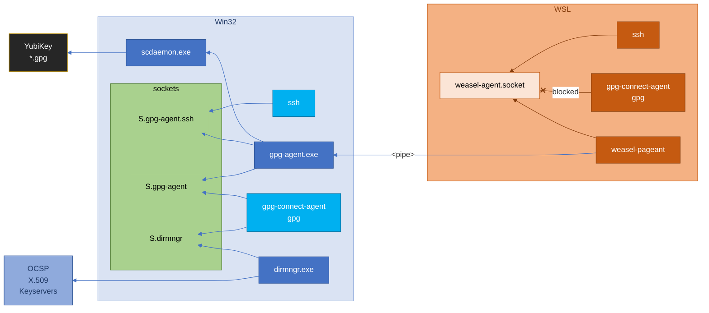

```mermaid
%%{init: {
  "theme": "base",
  "layout": "dagre",
  "themeVariables": { "lineColor": "#4472C4", "edgeLabelBackground": "#ffffff", "fontSize": "15px" },
  "themeCSS": "background-color: #ffffff !important;"
}}%%
flowchart RL

    %% Styles
    classDef daemon  fill:#4472C4,stroke:#2F5597,color:#fff
    classDef client  fill:#00B0F0,stroke:#0070A0,color:#fff
    classDef wslnode fill:#C55A11,stroke:#843C0C,color:#fff
    classDef wsock   fill:#FBE5D6,stroke:#C55A11,color:#000
    classDef sock    fill:#A9D18E,stroke:#A9D18E,color:#000
    classDef key     fill:#262626,stroke:#BF9000,color:#fff
    classDef net     fill:#8FAADC,stroke:#2F5597,color:#1F3864

    %% External
    yubikey["YubiKey<br/>*.gpg"]:::key
    cloud["OCSP<br/>X.509<br/>Keyservers"]:::net

    %% WSL
    subgraph wsl [WSL]
        l_ssh["ssh"]:::wslnode
        wsocket["weasel‑agent.socket"]:::wsock
        l_gca["gpg‑connect‑agent<br/>gpg"]:::wslnode
        pageant["weasel‑pageant"]:::wslnode
    end

    %% Win32
    subgraph win32 [Win32]
        scdaemon["scdaemon.exe"]:::daemon
        w_ssh["ssh"]:::client
        gpgagent["gpg‑agent.exe"]:::daemon
        w_gca["gpg‑connect‑agent<br/>gpg"]:::client
        dirmngr["dirmngr.exe"]:::daemon
        subgraph sockets [sockets]
            s_ssh["S.gpg‑agent.ssh"]:::sock
            s_agent["S.gpg‑agent"]:::sock
            s_dirmngr["S.dirmngr"]:::sock
        end
    end

    %% Links inside WSL
    l_ssh --> wsocket
    l_gca -- blocked --x wsocket
    pageant --> wsocket

    %% Pipe and Win32 links (extra dashes widen the layout on purpose)
    pageant -- "#lt;pipe#gt;" ----> gpgagent
    w_ssh --> s_ssh
    gpgagent --> scdaemon --> yubikey
    gpgagent --> s_ssh & s_agent
    w_gca --> s_agent & s_dirmngr
    dirmngr --> s_dirmngr
    dirmngr ---> cloud

    %% Containers and links
    style win32   fill:#DAE3F3,stroke:#8FAADC,color:#1F3864
    style sockets fill:#A9D18E,stroke:#548235,color:#000
    style wsl     fill:#F4B183,stroke:#C55A11,color:#843C0C
    linkStyle 0,1,2 stroke:#843C0C
```
